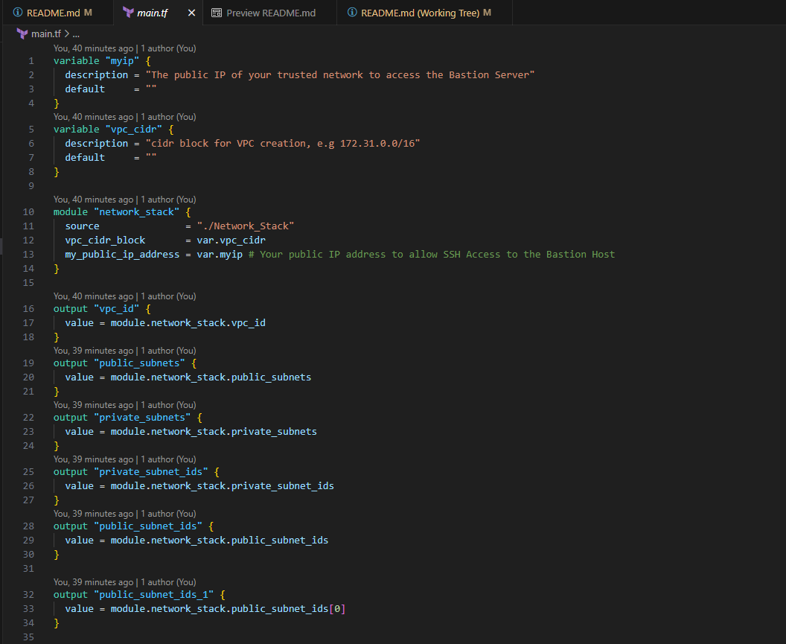
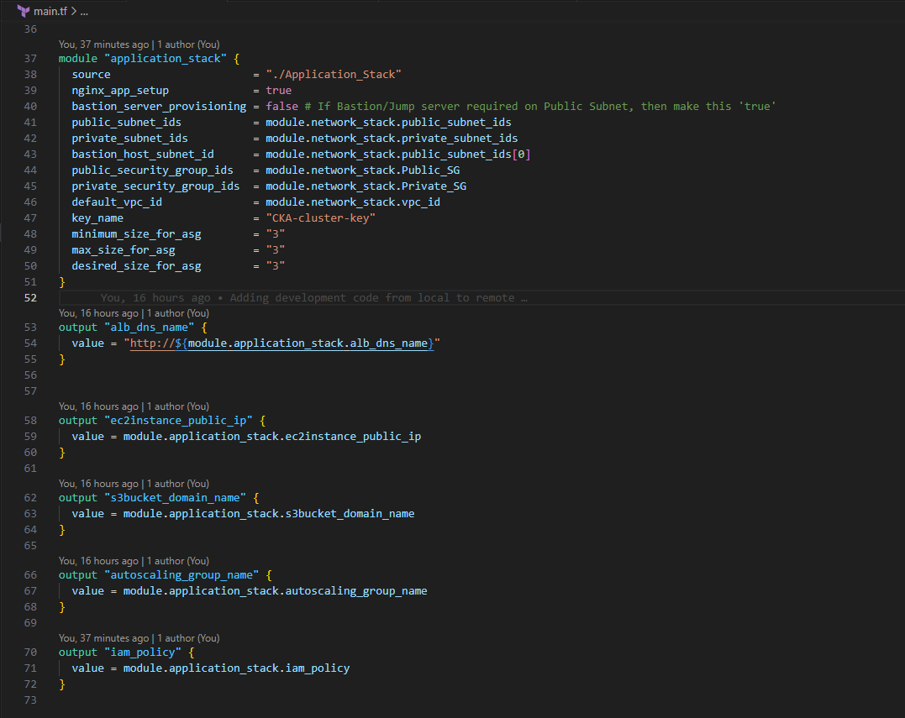
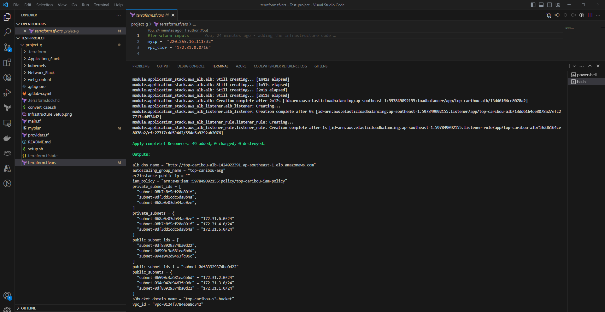
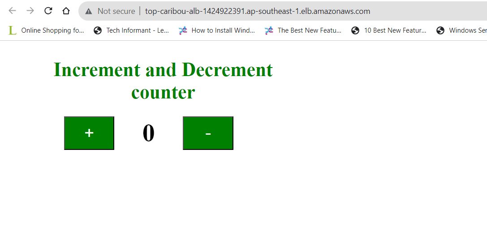
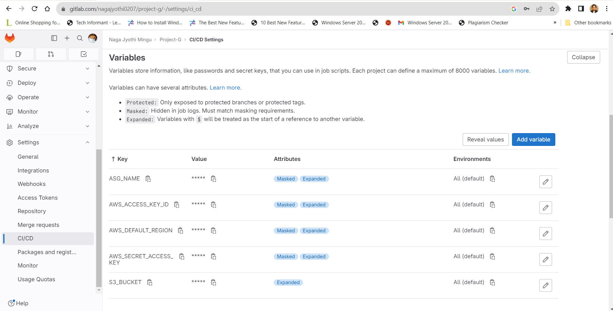
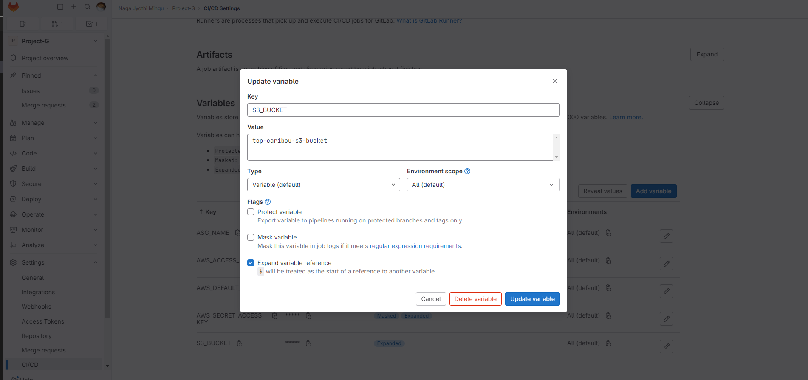
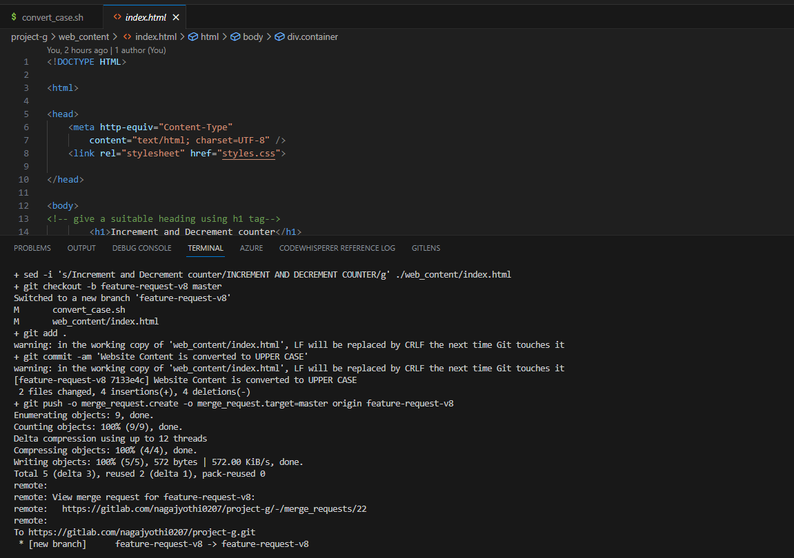
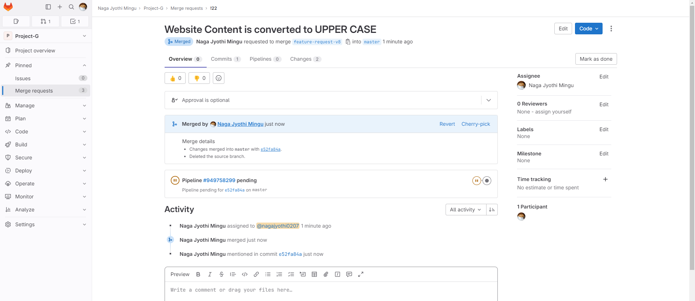
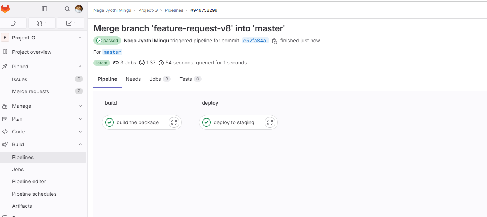
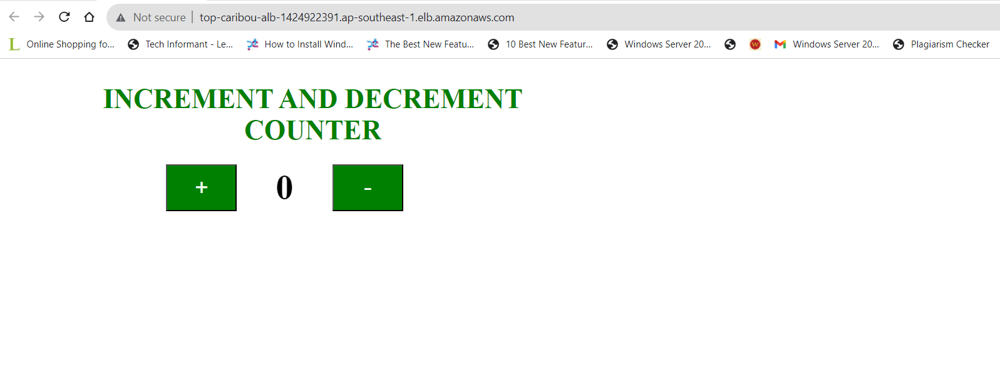

# Project-G

## Scenario 1 - Terraform, AWS, CICD

In this scenario Terraform deploys highly available auto-scaling group of 3 AWS EC2s (Server fleet A, t2.micro instance type) running nginx to serve public web content, behind a public ALB in the Singapore region. The EC2 servers when booting up will download the web content from a private S3 bucket.

## Assumptions:
1) **SSH key is already generated or uploaded to AWS - change the key name to represent your own key before running the terraform commands**
2) **AWS credentials with admin previlges are configured in your local laptop to provision the resources using terraform**
3) **To make the code change and deploy using gitlab-ci, it required repository permissions to push the code**
4) **A IAM user with access key and secret key for github access**
5) **Change the index.html page content to to lower case before similating the deployment using gitlab-ci**

Please refer the IAC deployment configuration in `main.tf` file

By using this terraform stack the below resources will be provisioned to accomodate this architecture design:

**Network stack:**
1) A VPC with CIDR range of 172.31.0.0/16
2) 3 Public and Private subnets with NACL's and Route tables
3) 1 EIP for NAT gateway
4) 1 Internet gateway
5) VPC endpoints for s3 (gateway) and SSM (Interface)
6) public and private security groups

**Application Stack:**
1) **[optinal]** A Bastion server to connect private instances.
2) Autoscaling group spin up the required Ec2 on launch with the user data script is added to the launch congiguration
3) S3 bucket will be created along with the content to load the webpage
4) IAM role will be created along with policy attached with ec2 and ssm policy permissions.
5) Load balancer will be created with the alb target group and listeners attached.


### Network Stack - Terraform



### Application Stack - Terraform



## 1. Terraform Deployment - AWS Infrastructure Setup
These instructions for setting up Terraform on your local development environment and deploying the infrastructure using Terraform.

## Prerequisites

Before you begin, make sure you have the following installed on your laptop:

1. **Terraform**: Install Terraform on your machine. You can download the latest version (**required_version = ">= 1.2.0"**) from the official website: [Terraform Downloads](https://www.terraform.io/downloads.html).

2. **Git**: Ensure you have Git installed to clone the project repository. You can download Git from [here](https://git-scm.com/downloads).

3. **AWS Account**: Sign up for an account with your AWS Account where you want to deploy the infrastructure. Make sure you have the necessary credentials (access keys, tokens, etc.) to authenticate with your AWS Account. Since the IaC code included to provision the VPC,IAM roles and Application services(ec2,alb,asg), the required permissions are needed.

4. **Text Editor or IDE(Visual Studio Code)**: Choose a text editor or integrated development environment (IDE) of your choice. Popular options include Visual Studio Code.

## Getting Started

Follow the steps below to set up the Terraform project and deploy the infrastructure:

1. **Clone the Repository**: Clone the project repository to your local machine using Git. Open your **Git Bash terminal** or command prompt and run the following command:

   ```bash
    git clone https://gitlab.com/nagajyothi0207/project-g.git
    cd project-g
    git checkout master
   ```

2. **Configure AWS Credentials**: Set up the necessary credentials for your AWS Account. For example, if you are using AWS, configure your AWS access keys and secret access keys using the AWS CLI or environment variables. Refer to the documentation for detailed instructions [AWS CLI Installation](https://docs.aws.amazon.com/cli/latest/userguide/getting-started-install.html#getting-started-install-instructions) and [iam user with static credential](https://docs.aws.amazon.com/cli/latest/userguide/cli-authentication-user.html)

3.  **Run the Script to complete terraform deployment workflow** The shell script will help to your run the Terraform workflow. 
    ```bash
    sh setup.sh
    ```

4. **[OPTIONAL] Initialize Terraform**: The shell script will help to your run the Terraform workflow. 
Change into the cloned repository directory and initialize Terraform. This will download the required plugins for your provider.

   ```bash
   terraform init
   ```

5. **[OPTIONAL] Review and Modify Configuration**: Inspect the Terraform configuration files (usually with `.tf` extension) in the repository. Make any necessary adjustments to suit your specific requirements, such as changing resource names, regions, or instance types.

6. **[OPTIONAL] Plan the Deployment**: Run the Terraform plan command to see the execution plan without actually deploying the infrastructure. This step will show you what resources Terraform intends to create.

   ```bash
   terraform plan -out myplan
   ```

7. **[OPTIONAL] Deploy the Infrastructure**: If the plan looks good, you can proceed with the actual deployment. Execute the Terraform apply command to create the infrastructure:

   ```bash
   terraform apply myplan
   ```

8. **Terraform will print the provisioned Resources outputs.**



9. **Webpage verification - Successful deployment will show the page like below**

click on the terraform output of loadbalancer url. 




## 2. Gitlab CI Setup for Code change deployments


### Activities involved to achieve the code change and a successfull deployment using gitlab CI
1.  AWS Static Credentials to Connect from gitlab to AWS resources for deployment - For maintaining the least previleges, use the policy created above using Terraform deployment
2. gitlab CICD environment variables configuration
3. gitlab comes with `main` as a default brach. i have added code to `master` branch for this deployment purpose.
4. change from main to master. Or [covert_case.sh](convert_case.sh) will help you to add the modified code to `master` branch to trigger the deployment of modified code.
5. Post Deployment Validation by accessing the same Application LoadBalancer (ALB) url

## Getting Started

Follow the steps below to set up the Gitlab project to deploy the code changes:

1. **Gitlab environment variable Configuration for CICD**
 Go to the Setting of the repository <https://gitlab.com/nagajyothi0207/project-g.git>, and select the CICD for environment variable setup. Set the environment variable like below.

 

 Example of S3 bucket name variable:




 2. **Deployment of Code changes to the fleet of EC2 instance runnin in Autoscaling Group**
   The below script execution will help to modify the [index.hml](web_content/index.html) and submit the Pull Request (PR) to the master branch.

      ```bash
         sh convert_case.sh feature-request-v10
      ```

Outcome of the script execution: 


3. **Pull Request(PR) Approval and Auto Triggering the Gitlab Deployment**

Pull Request (PR Approval from gitlab console) and CICD Deployment


Successfull CICD Deployment



5. **Post Deployment Validation**

Post deployment validation - Access/Refresh the ALB url to check the content update from **LOWER** Case to **UPPER** Case.


## Clean Up the resources


1. **Destroy the Infrastructure (Optional)**: If you want to tear down the infrastructure and remove all resources, you can use the Terraform destroy command:

   ```bash
   terraform destroy
   ```

   **Note:** Be cautious when using `terraform destroy` as it will permanently delete all resources created by Terraform.


 # Further improvements to above architecture 

 1. **Exposing ALB URL on the custom domain(e.g: app.mycompany.com) helps to remember the application name easy & removing the insecure port 80 and enforcing the port 443 using TLS/SSL Certificate helps to secure the website/Application**
 2. **ALB Supports WebApplicationFirewall(WAF), Recommended to use to prevent from Layer 7 Attacks.**
 3. **ALB can be exposed over the CloudFront to reduce the latency of by leveraging the CDN features. It helps to further to mitigate from the DDOS.**
 4. **The S3 bucket used to store the Web Content should be encrypted using CMK (KMS Key - Managed by Customer)**
 5. **MOST IMPORTANT - Last but not least - Avoid Using AWS IAM Static Credentials - ACCESS_KEY and SECRET ACCESS KEY. Dynamic Credentials/ROLES are recommended to Assume per session based access.**
 
## Conclusion

Using AWS Static Credentials (Access Key and Secrets Access Key) is not a best practice. Remember to follow the AWS best practices, version control your Terraform code, and be cautious while performing deployments and destroy actions.

# Please Refere to Scenario 2 here - [Nginx, MySQL Prometheus and Grafana deployment on K8S](./kubernets/README.md)
