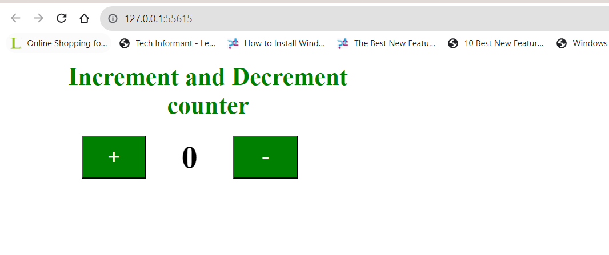
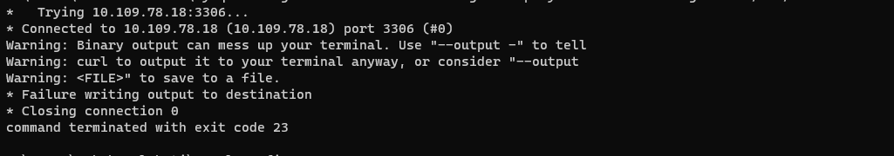
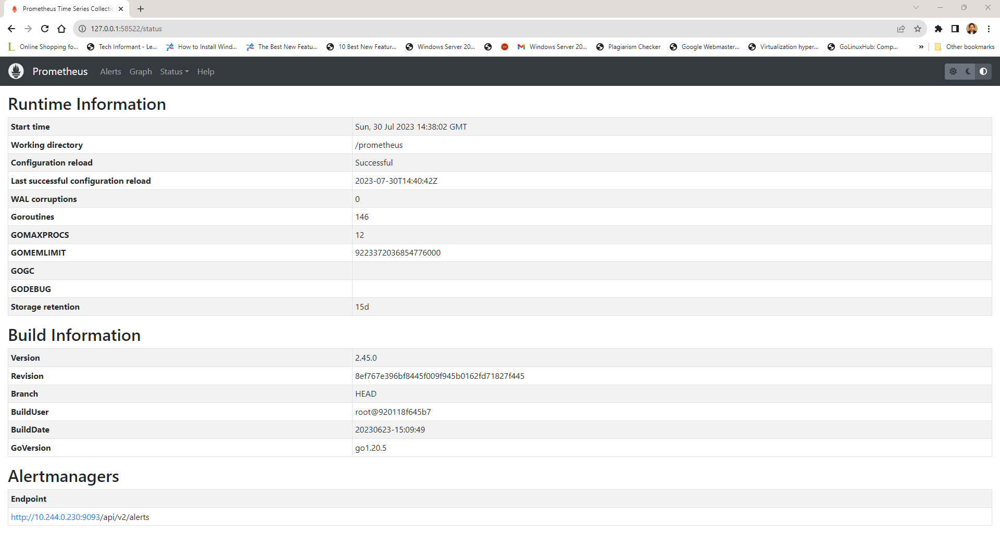
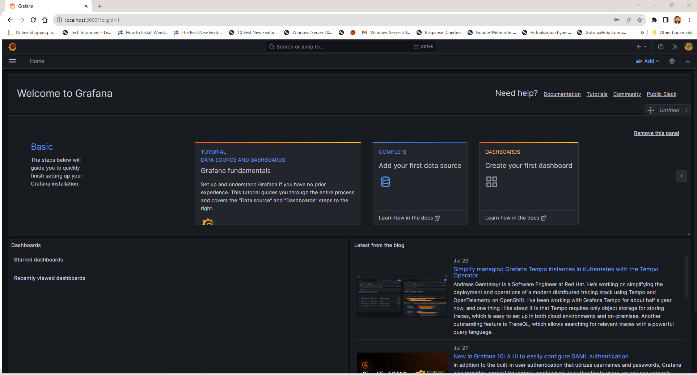

# Scenario2:

# Kubernetes Deployment for Nginx and MySQL with Monitoring using Prometheus and Grafana

This repository contains the necessary files and configurations to deploy Nginx and MySQL on a Kubernetes cluster, along with setting up monitoring using Prometheus and Grafana.

## Prerequisites

Before proceeding, make sure you have the following installed:

1. Kubernetes cluster: Ensure you have a functional Kubernetes cluster up and running.
2. `kubectl`: The Kubernetes command-line tool (`kubectl`) must be installed and configured to connect to your Kubernetes cluster.
3. Helm: We'll use Helm to install Prometheus and Grafana.

## Assumtions & Limitations:
1. Kubernetes cluster with CNI to support Network policies/Pod to Pod network communication with local.dns
2. If you're running on Minikube - please start with CNI Plugin `minikube start --nodes 2 --network-plugin=cni --cni=flannel`
3. Due to Inter Service resolution limiation in Minikube, i am not executing the mysql script using initContainer inside the nginx deployment.

## Deployment
Now let’s proceed toward deploying the Kubernetes configuration files that will be creating the Kubernetes resources.

**Nginx and Mysql** deployment have the following configurations.

1. **Secret**
2. **Persistent Volume Claim**
3. **ConfigMap**
4. **Deployment**
5. **Service**
### Step 1: Deploy Nginx and MySQL

We will use Kubernetes Deployments to deploy Nginx and MySQL. The deployment files are already provided in the repository.

1. Deploy Nginx and mysql deployments:

```bash
kubectl apply -f .
```


Ensure that the Nginx and MySQL deployments are successfully created and running:

```bash
kubectl get deployments
kubectl get pods
```

### Step 2: Expose Nginx to External Traffic

We will expose Nginx externally using a Kubernetes Service of type LoadBalancer.

```bash
minikube tunnel
kubectl get services 
kubectl get services deploymentName
```


Or

you can directly expose the service and access the service

```bash
minikube service nginx-service --url
```


Post deployment validation - Access the nginx page.



###  Expose Nginx to mysql Connectivity verification

Step -1: Get the mysql Service IP to run the curl/telnet command from nginx Pod.

Step 2: Do the port-forwarding if you're using minikube that not supporting to `ClusterIP`
```bash
kubectl.exe get pods
kubectl.exe port-forward mysql-6c57686c99-xhr7g 3306:3306

```

```bash
kubectl.exe get svc mysql | grep mysql | awk  '{ print $3 }'
kubectl get pods
kubectl.exe exec -it nginx-deployment-7449f8564d-5gfmm -- /bin/bash  -c "curl -v telnet://10.109.78.18:3306"
```


### Step 3: Set Up Monitoring with Prometheus and Grafana

We will use Helm to install Prometheus and Grafana on our Kubernetes cluster.

1. Install Prometheus:

```bash
helm repo add prometheus-community https://prometheus-community.github.io/helm-charts
helm install prometheus prometheus-community/prometheus
```

The Prometheus PushGateway can be accessed via port 9091 on the following DNS name from within your cluster:
prometheus-prometheus-pushgateway.default.svc.cluster.local

Get the PushGateway URL by running these commands in the same shell:
```bash 
  export POD_NAME=$(kubectl get pods --namespace default -l "app=prometheus-pushgateway,component=pushgateway" -o jsonpath="{.items[0].metadata.name}")
  kubectl --namespace default port-forward $POD_NAME 9091
```

2. Install Grafana:

```bash
helm repo add grafana https://grafana.github.io/helm-charts
helm install grafana grafana/grafana
export POD_NAME=$(kubectl get pods --namespace default -l "app.kubernetes.io/name=grafana,app.kubernetes.io/instance=grafana" -o jsonpath="{.items[0].metadata.name}")
kubectl --namespace default port-forward $POD_NAME 3000
```
1. Get your 'admin' user password by running:

   kubectl get secret --namespace default grafana -o jsonpath="{.data.admin-password}" | base64 --decode ; echo


2. The Grafana server can be accessed via port 80 on the following DNS name from within your cluster:

   grafana.default.svc.cluster.local

   Get the Grafana URL to visit by running these commands in the same shell:
   ```bash 
     export POD_NAME=$(kubectl get pods --namespace default -l "app.kubernetes.io/name=grafana,app.kubernetes.io/instance=grafana" -o jsonpath="{.items[0].metadata.name}")       
     kubectl --namespace default port-forward $POD_NAME 3000
   ```


3. Login with the password from step 1 and the username: admin
### Step 4: Access Prometheus and Grafana Dashboards

By default, the Prometheus and Grafana services are exposed as ClusterIP. To access them externally, we will set up port forwarding.


1. For Prometheus:

```bash
kubectl port-forward svc/prometheus-server 9090:9090
kubectl expose service prometheus-server --type=NodePort --target-port=9090 --name=prometheus-server-np
minikube service prometheus-server-np
```

Now, you can access Prometheus at `http://localhost:9090` in your web browser.




2. For Grafana:

Post deployment validation - Access Grafana



```bash
kubectl port-forward svc/grafana 3000:80
```

Now, you can access Grafana at `http://localhost:3000` in your web browser. Use the default username `admin` and the password provided by Grafana during installation to log in.

### Step 5: Configure Prometheus Data Source in Grafana

1. Log in to Grafana using the credentials provided earlier.

2. Navigate to `Configuration` > `Data Sources` > `Add data source`.

3. Select `Prometheus` as the data source type.

4. In the HTTP settings section, set `http://prometheus-server` as the URL.

5. Click `Save & Test` to test the connection. You should see a "Data source is working" message.

### Step 6: Import Prometheus Dashboard in Grafana

1. In Grafana, go to `Create` > `Import`.

2. Enter the following Dashboard ID to import the pre-configured Prometheus dashboard for Kubernetes:

   Dashboard ID: `10856`

3. Click `Load`.

Now, you have a Grafana dashboard set up with metrics collected from Prometheus.

## Cleanup

To clean up the resources, run the following commands:

```bash
kubectl delete deployment nginx-deployment
kubectl delete deployment mysql-deployment
kubectl delete service nginx-service
helm uninstall prometheus
helm uninstall grafana
```
